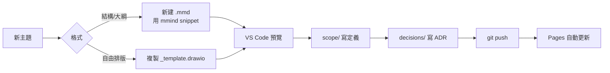

# LiquidJet-Project-Visualization

> LiquidJet 專案的總門戶與心智圖編輯器。
> 部署為 GitHub Pages：[benden-npi.github.io/LiquidJet-Project-Visualization](https://benden-npi.github.io/LiquidJet-Project-Visualization/)

---

## 📂 結構

```
.
├── portal/            # 上位入口頁（總門戶）
├── editor/            # 互動式心智圖畫布編輯器（HTML 單檔 SPA）
├── mindmaps/          # 心智圖原始檔 (.mmd / .drawio)
├── scope/             # 範圍文件 (Markdown)
├── decisions/         # ADR 決策紀錄
├── scripts/           # 建置 / 本機編輯伺服器
├── .vscode/           # 推薦外掛、設定、snippets
└── .github/workflows/ # CI：發佈到 GitHub Pages
```

每個資料夾都有 `README.md` 與 `_template.*`，照樣複製改寫即可。

---

## 🚀 部署網址

| 內容 | URL |
|------|-----|
| LiquidJet 總門戶 | <https://benden-npi.github.io/LiquidJet-Project-Visualization/> |
| 心智圖編輯器（線上版） | <https://benden-npi.github.io/LiquidJet-Project-Visualization/editor/> |
| Control Plan（管制計畫表） | <https://benden-npi.github.io/LiquidJet-Project-Visualization/scope/control-plan.html> |
| Yield 子專案 | <https://benden-npi.github.io/Yield/> |

`push` 到 `main` 會觸發 [.github/workflows/pages.yml](.github/workflows/pages.yml)：把 `portal/` 與 `editor/` 打包後部署到 Pages。

---

## 🧠 日常工作流程



### 1. 開新心智圖

- **Mermaid**：`mindmaps/` 下新增 `YYYYMMDD-<topic>.mmd`，輸入 `mmind` 觸發 snippet。
- **Draw.io**：複製 `mindmaps/_template.drawio` 改名後雙擊編輯。
- 或直接在線上[編輯器](https://benden-npi.github.io/LiquidJet-Project-Visualization/editor/)新增 → 透過 GitHub Token 提交。

### 2. 預覽

| 檔案類型 | 預覽方式 |
|----------|----------|
| `.mmd` | Mermaid Editor 右上角 Preview |
| `.md`（含 mermaid） | `Ctrl+Shift+V` Markdown Preview |
| `.drawio` | 直接雙擊（Draw.io Integration 外掛） |

### 3. 沉澱：scope + decisions

- 心智圖只負責 **發散**；定案的範圍寫到 [scope/](scope/)。
- 任何方向性的選擇（工具、架構、優先級）寫成 ADR 放 [decisions/](decisions/)。

---

## 🖥 本機編輯器

```bash
npm run edit
# 打開 http://localhost:5173
```

直接讀寫 `mindmaps/` 下的 `.mmd` 檔。

## ☁️ 線上編輯器（GitHub Pages 版）

| 環境 | 偵測方式 | 存檔到 |
|------|----------|--------|
| 本機 `npm run edit` | `/api/files` 有回應 | `mindmaps/` 直接寫檔 |
| GitHub Pages | 無本機 API | 透過 GitHub Contents API commit 回 repo |

### 第一次使用（線上版）

1. 開編輯器網址
2. 右上 ⚙ → 貼上 fine-grained PAT
3. 產 PAT：GitHub → *Settings → Developer settings → Personal access tokens → Fine-grained tokens*
   - **Repository access**：只勾選此 repo
   - **Repository permissions** → **Contents**：`Read and write`
4. 按「測試連線」確認後儲存

Token 只存在你瀏覽器的 `localStorage`，**不會傳到任何伺服器**。
其他人沒 token = 只能看 Pages，按 ⚙ 後也無法寫入。

每次儲存 = 一個 commit → 觸發 CI → Pages 自動更新。

---

## 🤖 AI 自動運轉（MVP）

入口：`editor/`（本機 `npm run edit` 或 Pages 版）

- 右上按 **AI Suggest** 手動觸發三類任務：
  - 心智圖結構補全建議
  - 命名 / 分類建議
  - Control Plan 欄位缺漏檢查
- 結果顯示在右側建議面板，含 **diff preview**。
- 可按 **套用** 一鍵把建議寫入目前草稿。

### 安全與治理

- AI 不會自動 commit，也不會直接改正式資料。
- 所有變更都先進草稿，仍需你手動按「儲存」才會寫回檔案。
- 若使用 webhook 模式，金鑰只存在瀏覽器 `localStorage`，不會寫進 repo。

### 自動檢查（可選）

- 可在設定中開啟「儲存後自動檢查」。
- 開啟後每次儲存會自動跑檢查並更新建議面板。

---

## 📋 Control Plan（管制計畫表）

線上頁面：<https://benden-npi.github.io/LiquidJet-Project-Visualization/scope/control-plan.html>

- SSOT（單一資料來源）：
  - **controls** → [`scope/control-plan.json`](scope/control-plan.json)（build 時內嵌；同時也發佈到 Pages 供頁面輪詢用）。
  - **stations** → 沒有 repo 內 SSOT。執行時由 Power Automate 從 SharePoint `Control_Plan.xlsx` 直接同步到瀏覽器 `localStorage`（key `liquidjet_cp_stations_override_v1`），與 Yield · Process Readiness 共用同一個 webhook URL（key `tool_gantt_sharepoint_webhook_url`）。首次使用請按右上 ⚙ Settings → 從 Yield 同步。
- 頁面採「inline SSOT」：build 時把 JSON 內嵌進 HTML；同時也把 `control-plan.json` 一併發佈到 Pages，供頁面輪詢用。
- 編輯流程（線上版，需 PAT，權限同上方編輯器）：
  1. 直接在表格中編輯 → 變更先存到瀏覽器 `localStorage`（draft），右上角顯示 **unsaved** 徽章。
  2. 按 ⚙ → **提交到 GitHub** → 一個 commit 寫回 `scope/control-plan.json`。
  3. Commit 後 draft 不會立刻清除，徽章轉為 **pending Pages rebuild (<sha>)**；在 Pages 重新部署（~30–60s）落地前，畫面仍以本機 draft 顯示，避免刷新後看到舊的 inline SSOT（例如新建列的 ID 暫時消失）。
  4. 頁面會輪詢 `./control-plan.json`，偵測到部署已反映該 commit 後自動清除 draft 並重新整理。

---

## 🧩 內建 Snippets

| Prefix | 觸發位置 | 產出 |
|--------|----------|------|
| `mmind` | `.mmd` / markdown | Mermaid mindmap 骨架 |
| `mflow` | `.mmd` / markdown | Flowchart 骨架 |
| `mseq` | `.mmd` / markdown | Sequence diagram 骨架 |
| `mblock` | markdown | ` ```mermaid ` 區塊 |
| `adr` | markdown | ADR 起始文件（自動帶日期） |

定義位於 [.vscode/mindmap.code-snippets](.vscode/mindmap.code-snippets)。

---

## 📎 範例

- [mindmaps/example-project-scope.mmd](mindmaps/example-project-scope.mmd)
- [decisions/0001-use-mermaid-and-drawio.md](decisions/0001-use-mermaid-and-drawio.md)
