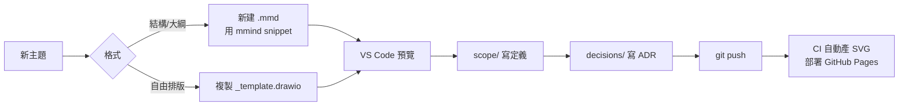

# LiquidJet-Project-Visualization

> 早期專案 scope / 腦力激盪 / 決策紀錄的個人化視覺化工作環境。
> 以 **Mermaid mindmap** 為主、**Draw.io** 為輔，Git 版控、CI 自動產 SVG、GitHub Pages 集中預覽。

---

## 📂 結構

```
.
├── mindmaps/          # 心智圖 (.mmd / .drawio)
├── scope/             # 範圍文件 (Markdown)
├── decisions/         # ADR 決策紀錄
├── scripts/           # 匯出與索引腳本
├── .vscode/           # 推薦外掛、設定、snippets
└── .github/workflows/ # CI：自動產 SVG 並部署到 Pages
```

每個資料夾都有 `README.md` 與 `_template.*`，照樣複製改寫即可。

---

## 🚀 第一次使用

1. 開啟此資料夾，VS Code 會跳出 **Recommended Extensions** 提示，全部安裝。
   - Mermaid Editor、Markdown Mermaid Preview、Draw.io Integration…等
2. 安裝匯出工具（一次性）：
   ```bash
   npm install
   ```
   會裝 [`@mermaid-js/mermaid-cli`](https://github.com/mermaid-js/mermaid-cli) 到 `node_modules/`。

---

## 🧠 日常工作流程



### 1. 開新心智圖

- **Mermaid**：`mindmaps/` 下新增 `YYYYMMDD-<topic>.mmd`，輸入 `mmind` 觸發 snippet。
- **Draw.io**：複製 `mindmaps/_template.drawio` 改名後雙擊編輯。

### 2. 預覽

| 檔案類型     | 預覽方式                                           |
| ------------ | -------------------------------------------------- |
| `.mmd`       | Mermaid Editor 右上角 Preview                      |
| `.md` (含 mermaid) | `Ctrl+Shift+V` Markdown Preview              |
| `.drawio`    | 直接雙擊（Draw.io Integration 外掛）              |

### 3. 匯出 / 集中瀏覽

```bash
npm run export      # mindmaps/*.mmd → dist/*.svg
npm run export:png  # 同上但輸出 PNG
npm run preview     # 產生 dist/index.html，瀏覽器打開即可
```

底線開頭的 `_template.mmd` 會被略過。

### 4. 沉澱：scope + decisions

- 心智圖只負責 **發散**；定案的範圍寫到 [scope/](scope/)。
- 任何方向性的選擇（工具、架構、優先級）寫成 ADR 放 [decisions/](decisions/)。

### 5. CI 自動預覽

`push` 到 `main` 或開 PR 時，[.github/workflows/mindmaps.yml](.github/workflows/mindmaps.yml) 會：

1. 用 `mmdc` 把所有 `.mmd` 轉成 SVG
2. 產生 `dist/index.html`
3. PR：上傳成 **Artifact**（`mindmap-preview`）可下載
4. `main`：部署到 **GitHub Pages**（需先在 repo Settings → Pages → Source 改為 *GitHub Actions*）

---

## 🧩 內建 Snippets

| Prefix   | 觸發位置          | 產出                          |
| -------- | ----------------- | ----------------------------- |
| `mmind`  | `.mmd` / markdown | Mermaid mindmap 骨架          |
| `mflow`  | `.mmd` / markdown | Flowchart 骨架                |
| `mseq`   | `.mmd` / markdown | Sequence diagram 骨架         |
| `mblock` | markdown          | ` ```mermaid ` 區塊           |
| `adr`    | markdown          | ADR 起始文件（自動帶日期）    |

定義位於 [.vscode/mindmap.code-snippets](.vscode/mindmap.code-snippets)。

---

## 🛠 客製化建議

- 想加新圖種（如 timeline、gitGraph）：到 snippets 加一條，CI 不必動。
- 想換主題色：改 `.vscode/settings.json` 的 `markdown-mermaid.lightModeTheme`。
- 想換 ADR 格式（如 MADR full）：改 `decisions/_template.md`。
- 想關掉 Pages 部署：把 workflow 裡 `deploy` job 註解掉，只留 artifact。

---

## 📎 範例

- [mindmaps/example-project-scope.mmd](mindmaps/example-project-scope.mmd)
- [decisions/0001-use-mermaid-and-drawio.md](decisions/0001-use-mermaid-and-drawio.md)