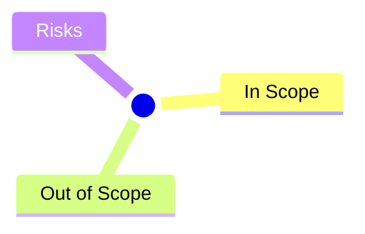

# <Topic> Scope

- Status: Draft | Review | Approved
- Owner: <name>
- Last updated: YYYY-MM-DD

## Context / Background

簡述為何要做這件事、目前狀態。

## Objectives

- [ ] Objective 1
- [ ] Objective 2

## In Scope

- ...

## Out of Scope

- ...

## Stakeholders

| Role | Name | Responsibility |
|------|------|----------------|
|      |      |                |

## Success Criteria

- Metric / KPI

## Open Questions

- Q1

## Related

- Mindmap: `../mindmaps/<file>.mmd`
- Decisions: `../decisions/<file>.md`

